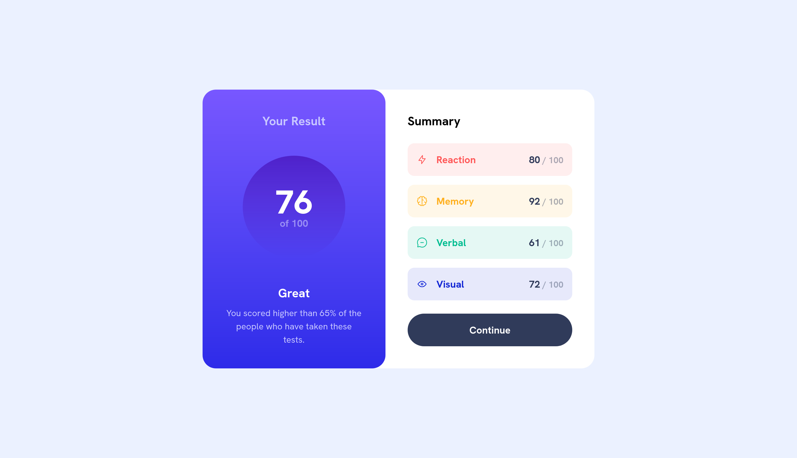

# Frontend Mentor - Results summary component solution

This is a solution to the [Results summary component challenge on Frontend Mentor](https://www.frontendmentor.io/challenges/results-summary-component-CE_K6s0maV). Frontend Mentor challenges help you improve your coding skills by building realistic projects.

## Table of contents

-   [Frontend Mentor - Results summary component solution](#frontend-mentor---results-summary-component-solution)
    -   [Table of contents](#table-of-contents)
    -   [Overview](#overview)
        -   [The challenge](#the-challenge)
        -   [Screenshot](#screenshot)
        -   [Links](#links)
    -   [My process](#my-process)
        -   [Built with](#built-with)
        -   [What I learned](#what-i-learned)
        -   [Useful resources](#useful-resources)

## Overview

### The challenge

Users should be able to:

-   View the optimal layout for the interface depending on their device's screen size
-   See hover and focus states for all interactive elements on the page
-   **Bonus**: Use the local JSON data to dynamically populate the content

### Screenshot

### Links

-   Solution URL: [Add solution URL here](https://your-solution-url.com)
-   Live Site URL: [Add live site URL here](https://your-live-site-url.com)

## My process

### Built with

-   Semantic HTML5 markup
-   CSS custom properties
-   Flexbox
-   Mobile-first workflow
-   [React](https://react.dev/) - JS library
-   [vite](https://vite.dev/) - React framework
-   [Tailwind](https://tailwindcss.com/) - For styles

### What I learned

-   How do you display UI with React and use tailwind to style it fast.
-   How do you setup your project structure for making it scalable.

### Useful resources

-   [React docs](https://react.dev/learn) - Learning how to think in React itself.
-   [Tailwind docs](https://tailwindcss.com/docs) - Refer to styling classes and how to do things in tailwind (styling, syntax)
